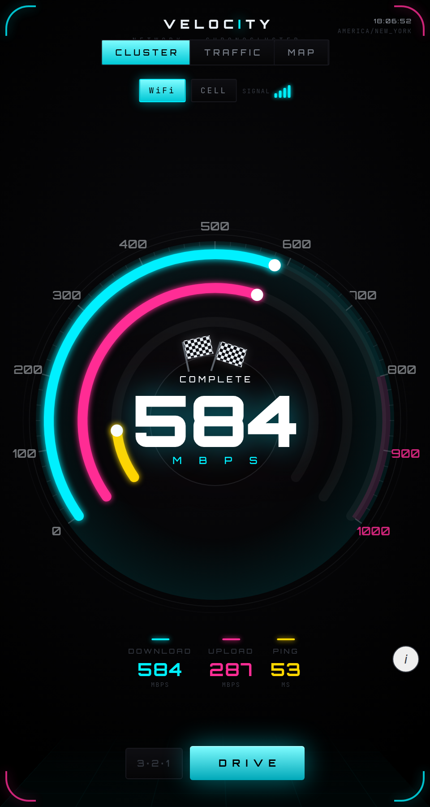
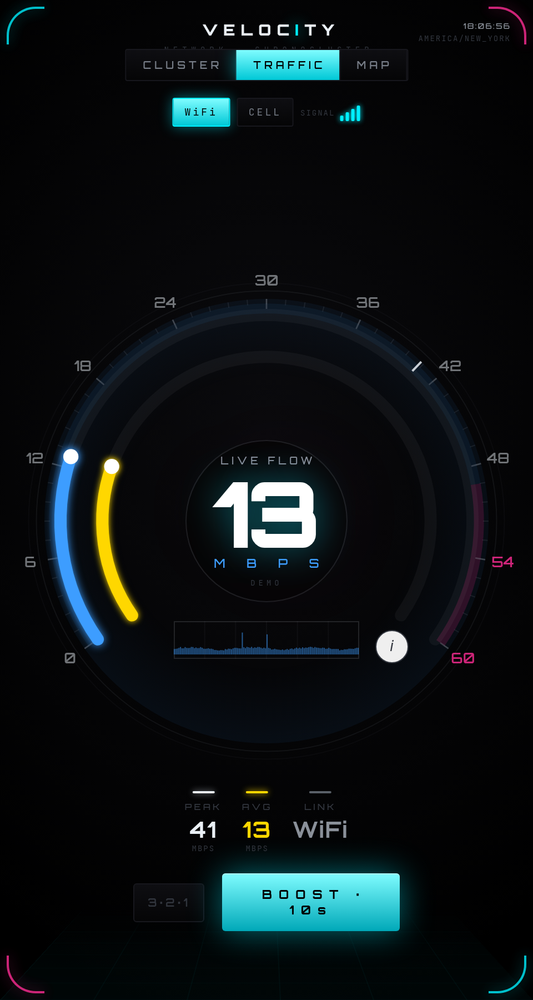
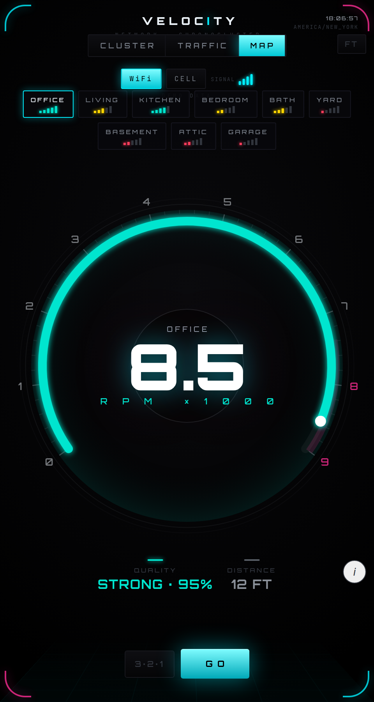

<div align="center">

# velocity

### A network speed test built as one chronograph instrument — in a single HTML file.

**▶ Live — [codereimagine.github.io/velocity](https://codereimagine.github.io/velocity/)**

<p>
  
  
  
</p>

<sub>CLUSTER · TRAFFIC · MAP — three faces, one instrument</sub>

<sub>By <b>Bert Peters</b> · <a href="https://github.com/codereimagine">codereimagine</a></sub>

</div>

---

velocity measures your connection and shows it as a living instrument. Three faces, one tool:

- **CLUSTER** — download, upload and ping on a single dial, run with one tap.
- **TRAFFIC** — live throughput with peak and session average.
- **MAP** — signal strength, room by room.

## How it works

- **Real measurement, no keys.** Download, upload and latency run over Cloudflare's keyless HTTPS endpoints, measured on a settled window (TCP slow-start excluded) with a per-run stability error bar — every reading carries how steady it was.
- **No accounts, no trackers, no ads.** Nothing is collected or sent anywhere but the speed endpoints; room readings are saved only in your own browser.
- **One self-contained file.** The whole app is a single HTML page. A strict Content-Security-Policy pins the script by hash and locks network egress to the speed endpoints — nothing else can run or phone home.

## Tech

Vanilla JavaScript · Canvas 2D + `requestAnimationFrame` · `localStorage` · a hash-pinned Content-Security-Policy · embedded JetBrains Mono + Orbitron fonts — all in one HTML file. No framework, no build step, no dependencies. Speed measured against Cloudflare's keyless HTTPS endpoints; an optional Python loopback helper (standard library only) adds true signal and flow readings when run on a laptop.

## Run it locally

The speed test needs an http origin (browsers block cross-origin fetches from `file://`), so serve the folder:

```bash
python3 -m http.server 8099
# open http://127.0.0.1:8099/index.html
```

## Credits

Built with [Claude Code](https://claude.com/claude-code).
